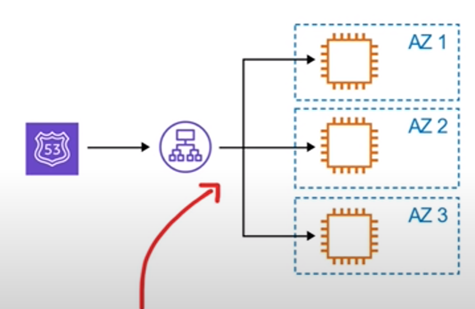
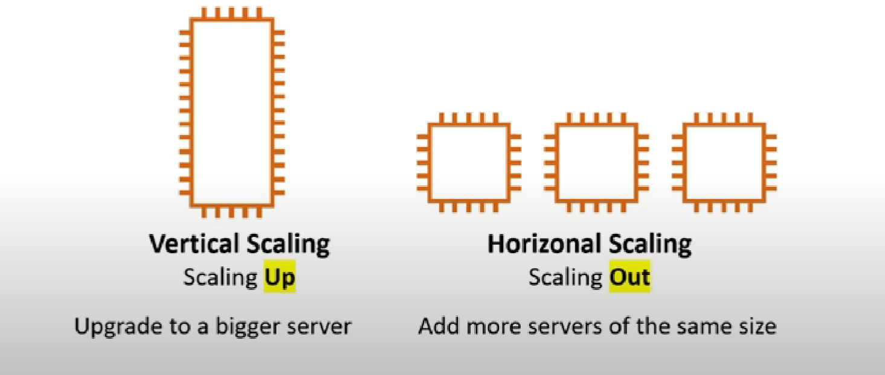
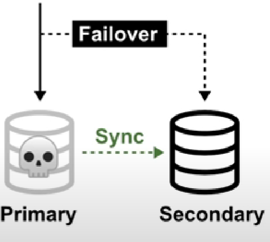
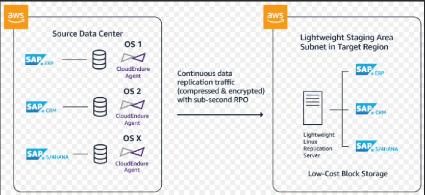
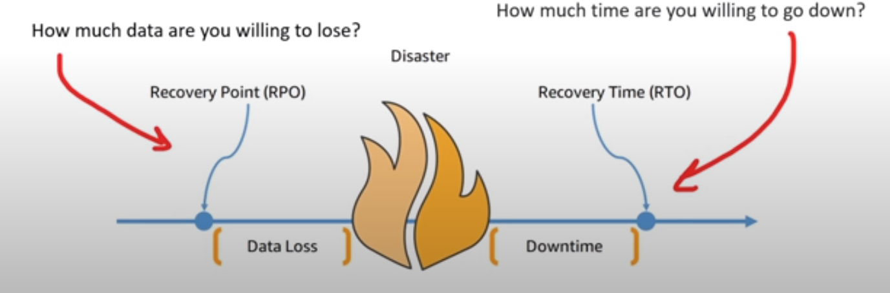
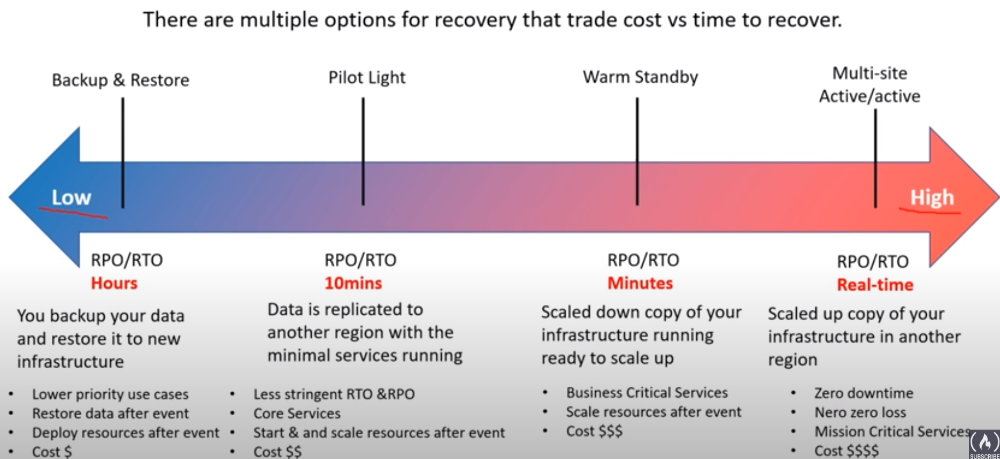
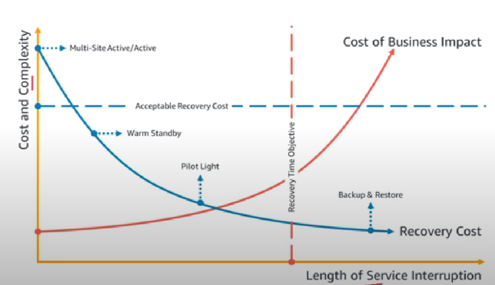
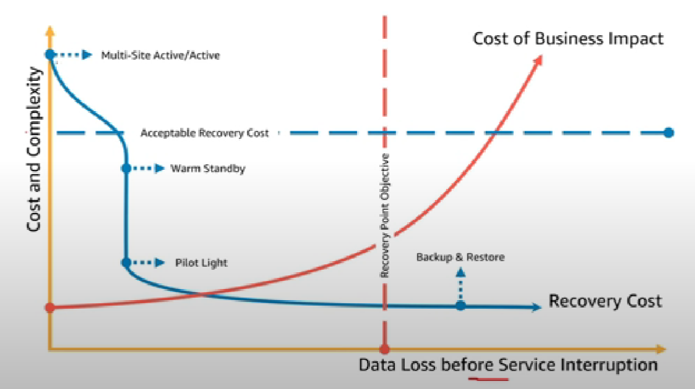

- [Cloud Architecture Terminologies](#cloud-architecture-terminologies)
    - [High Availability](#high-availability)
    - [High Scalability](#high-scalability)
    - [High Elasticity](#high-elasticity) 
    - [Fault Tolerance](#fault-tolerance)
    - [High Durability](#high-durability)
- [Business Continuity Plan](#business-continuity-plan)
    - [Disaster Recovery Options](#disaster-recovery-options)
- [Architectural Diagram Example](#architectural-diagram-example)

## Cloud Architecture Terminologies
---
- <b> What is Solutions Architect? </b>
    - <i> A role in technical organisation that architects a technical solution using multiple systems via researching, documentation and experimenting. </i>
    - Business Factors:
        - <u>(Security)</u> How secure is this solution?
        - <u>(Cost)</u> How much is this getting to cost?
- <b> What is Cloud Architect?</b>
    - A solutions architect that is solely focused on getting technical solutions using cloud services.
    - Business Requirements in designing the architecture:
        - <b> High Availability </b>
        - <b> Scalability </b> 
        - <b> Elasticity </b> - to grow or shrink to meet demand
        - <b> Fault Tolerance </b> - to prevent failure
        - <b> Disaster Recovery </b>

    ## High Availability
    ---

    - <i><u> no single point of failure</u></i>
    - running workload across multiple AZs such that they are always available when any one of them fails --- Applications remains always available

    

    - It is achieved by <b>Elastic Load Balancer</b>
        - Distributes <i>evenly </i> traffic accross multiple serveers in one or more data center
        - if data center is not available it will route the traffic to available data center
        - atleast two load balancers up and running
        - maintaining the thresholds of the load balancer
            
       
    ## High Scalability
    ---

    - <i>Increase capacity </i> based on increasing demand or traffic memory and computing power
    

    ## High ELasticity
    ---
    - <i> automatically </i> increase or decrease capacity based on current demand of traffic, memory and computing power
        - <b> Horizontal Scaling</b>
            - Scaling <i> Out </i> - add more servers of same size
            - Scaling <i> In </i> - Remove underutilized servers of the same size
            
            

        - <b> Vertical Scaling</b>
            - generally hard with traditional architecture so only horizontal scaling is supported for Elasticity
    - To accomplish highly elastic groups is achieved with 
        - <b> Auto Scaling Group (ASG) </b>
            - automatically add ro remove servers based on scaling rules you define based on metrics

    ## Fault Tolerance
    ---

    - <u><i>no single point of failure </i> </u>
    - Preventing the chance of failure
    - <b> Fail-overs </b> when you have to <i><u>shift traffic</u></i> to a redundant system when the primary system fails
    
    
        
        - a copy of (secondry) database where all ongoing changes are synced 
        - Secondary database is not in use until a fail over occurs and it becomes primary database

    ## High Durability
    ---
    - <b> Disaster Recovery (DR) </b>
        - to recover from a disaster
        - to prevent the loss of data Solutions that recover from a disaster 
        - Factors:
            - Do you have backup?
            - How fast can you restore that backup?
            - Does your backup still work?
            - How do you ensure current live data is not corrupt?
        - Solution:
            - <b> CloudEndure Disaster Recovery</b>
                - <i><u> Continously replicates your machine into low-cost staging area </u></i> in your target AWS account and preferred Region
                - Enables Fast and Reliable recovery in case of IT data center failures.

                

## Business Continuity Plan (BCP)
---

 - <i> A document that outlines how a business will continue when an <u>unplanned disruption occurs in services</u></i>
    - <b> Recovery Point Object (RPO) </b>
        - The max amount of data loss after the unplanned data-loss incident (Expressed in amount of time)
    - <b> Recovery Time Object (RTO)</b>
        - max amount to downtime your business can tolerate without financial loss
        

    ## Disaster Recovery Options
    ---
    

    ## Data Visualised
    ---
    - <b> RTO </b>:
        -<i><u> Max acceptable time delay </u></i>between interruption of service and acceptable of service
        - determines what is acceptable time window when service is unavailable , defined by organisation

        

    - <b> RPO </b>: 
        -  Max acceptable amount of time since the data recovery point.
        - Determines acceptable loss of data between last recovery point and  interruption of service , defined by organisation

        

## Architectural diagram example 
--- 

- build your own diagram for better understanding

