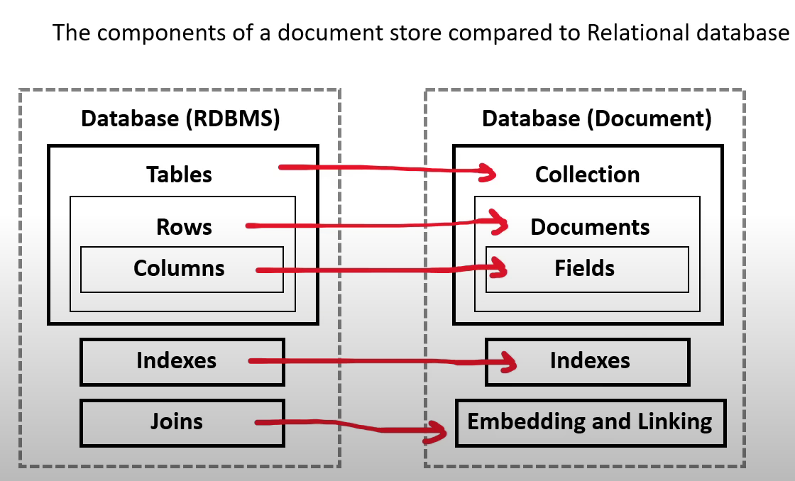

- [What is Database](#what-is-database)
- [What is Data Warehouse](#what-is-data-warehouse)
- [What is a key value store?](#what-is-a-key-value-store)
- [What is a document database?](#what-is-a-document-database)
- [NOSQL Database Services](#nosql-database-services)
    - [DynamoDB](#dynamodb)
    - [DocumentDB](#documentdb)
    - [Amazon Keyspaces](#amazon-keyspaces)
- [Relational Database Service](#relational-database-service)
---
## What is Database ?
---
- <i> A database is data-store that store semi=structured and structured data</i>
- A database is more complex stores because it requires using formal design and modeling techniques
- Database types:
    - <b> Relational Database </b>
        - Structured data represents tabular data (tables,rows and columns)
    - <b> Non-Relational Database </b>
        - Semi-Structured that may or may not represent tabular data 
- Set of functionality:
    - query 
    - modeling strategies to optimize retrieval for different use cases
    - control over the transformation of the data into useful data structures or reports

---
## What is Data Warehouse ?
---

- Relational Database : designed for analytic workloads and a column-oriented data-store
- Companies will have terabytes and millions of rows of data 
- Data warehouses generally perform <u> aggregation</u>
    - aggregation is is grouping data eg. finding a total or average
    - Data warehouses are optimised around columns since they need quickly aggregate column data 
- Data warehouses are generally designed be HOT
    - HOT means they can return queries very fast even though they have vast amounts of data
- Data warehouses are infrequently accessed 
    - intended for real time reporting but maybe once or twice a daya or once a week to generate business or user reports
- Data Warehouse needs to consume data from a relational database on a regular basis

---
## What is a Key Value Store ?
---
- <i> A key-value database is a type of non-relational database (NoSQL) that uses a simple key-value method to store data </i>
    - Stores a <u> unique key </u>  alongside a value
    - will interpret this data resembling a dictionary 
    - can resemble tabular data, it does not have to have the consistent columns per row
-Due to simple design so they can scale well beyond a relational database
 
---
## What is a document database ?
---
- Document store
    -<i> a NOSQL database that stores documents as its primary data-structure</i>
    - it could be an XML but more commonly is JSON or JSON-like
    - they are sub-class of key/value stores

        

----
## NOSQL Database Services
---- 
- ### DynamoDB
    - a serverless <u> NOSQL key/Value and document database</u>
    - designed to scale to billions of records  with consistent data return in at least a second
    - It is AWS's <u> flagship datbase service </U> meaning it is cost-effective and very fast 
    - In 2019, Amazon shutdown their last Oracle database and completed their migration to DynamoDB. They had 7,500 Oracle databases and 75 perabytes of data. With DynamoDB they reduce costs by 60% and reduce latency by 40%
    - It is a <u>massively scalable database </u>
- ### DocumentDB
    - A NOSQL <u> document database </u> that is <u>"MongoDB compatible"</u>
    - MongoDB is very popular NOSQL among developers there were open-source licensing issues around using open-source MongoDB , so aws got aorund it by just building their own MongoDB database
    - <i> when you want a MongoDB database </i>
- ### Amazon KeySpaces 
    - A fully managed <u> Apache Cassandra database </u>
    - Cassandra is an open-source NOSQL key/value database similar to DynamoDB in that is columnar store database but has some additional functionality
    - <i> when you want to use Apache Casandra </i>

---
## Relational Database Service
---

