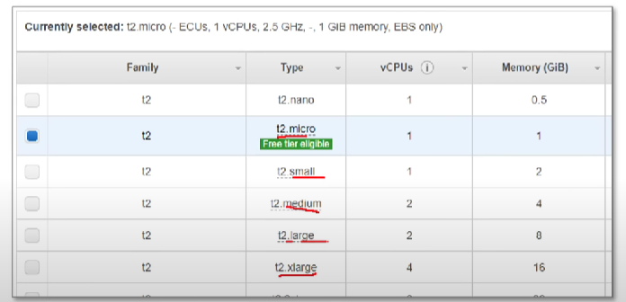
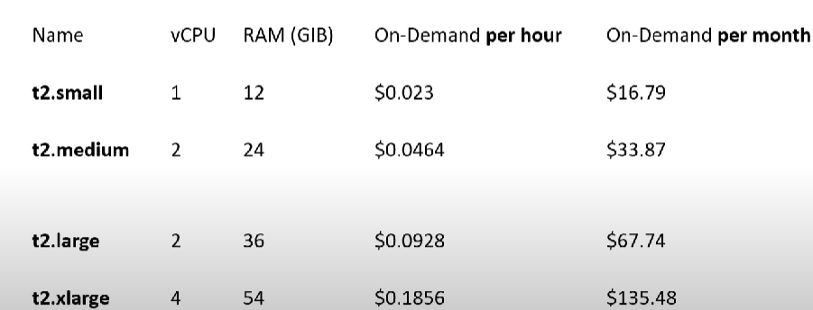
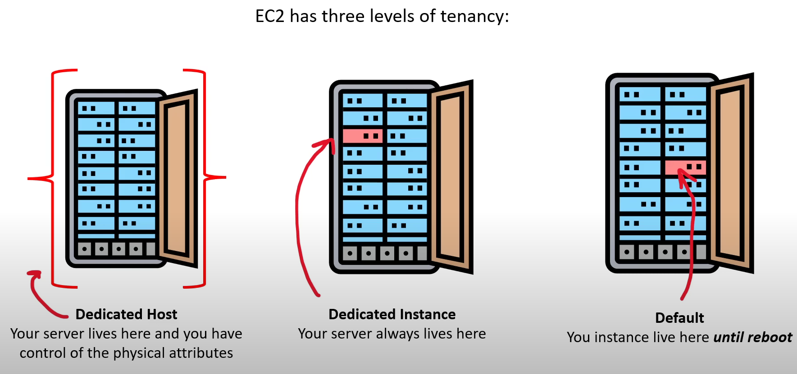

- [EC2 Instance Families](#ec2-instance-families)
- [EC2 Instance Types](#ec2-instance-types)
    - [General Purpose](#general-purpose)
    - [Compute Optimised](#compute-optimised)
    - [Memory Optimised](#memory-optimised)
    - [Accelerated Optimised](#accelerated-optimised)
    - [Storage Optimised](#storage-optimised)
- [Dedicated Hosts vs Dedicated Instances](#dedicated-hosts-vs-dedicated-instances)
- [Ec2 Tenancy](#ec2-tenancy)
---
## EC2 Intsance Families
--- 
- <b> What are instance Families ? </b>
    - Instance families are different combinations of CPU, Memory, Storage and Networking Capacity
    - Instance families allow you to choose the appropriate combination of capacity to meet your application's unique requirements
    - Different instance families are different because of varying hardware used to give them their unique properties

    - #### General Purpose 
        - balance of compute, memory and networking resources
        - Use-case: web servers and code repositories 
        - <b> A1 T2 T3 T3a T4g M4 M5 M5a M5n M6zn M6g M6i Mac </b>
    - #### Compute Optimized 
        - Ideal for compute bound applications that benefit from high performance processor 
        - Use-case: Scientific modeling, dedicated gaming servers and ad server engines
        - <b> C5 C4 Cba C5n C6g C6gn </b>
    - #### Memory Optimised 
        - fast perfromance for workloads that process large data sets in memory
        - Use-cases: in-memory caches, in-memory databases, real time big data analytics
        - <b> R4 R5 R5a R5b R5n X1 X1e High Memory z1d </b>
    - #### Accelerated Optimzed 
        - hardware accelerators, or co- processors
        - Use-cases: Machine learning, computational finance, seismic analysis, speech recognition 
        - <b>P2 P3 P4 G3 G4ad G4dn F1 Inf1 VT1 </b>
    - #### Storage Optimized 
        - high, sequential read and write access to very large data sets on local storage
        - Use cases: NOSQL, in-memory or transactional databases, data warehousing
        - <b> I3 I3en D2 D3en H1</b>

---
## Ec2 Instance Types 
---
- An instance type is a particular <b> instance size and instance family </b>
- A common pattern for instance sizes:
    - nano
    - micro
    - small
    - medium 
    - large 
    - xlarge 
    - 2xlarge 
    - 4xlarge
    - 8xlarge

    

- Ec2 instance Sizes are generally <b> double in price and key attributes </b>

    

---
## Dedicated Hosts vs Dedicated Instances
---

- Dedicated Hosts are single-tenant EC2 instances designed to let you Bring-Your-Own-License (BYOL) based on machine charecterstics

|                                                | Dedicated Instance                       | Dedicated Hosts                                                             |
| ---------------------------------------------- | ---------------------------------------- | --------------------------------------------------------------------------- |
| Isolation                                      | Instance Isolation                       | Physical server Isolation                                                   |
| Biling                                         | Per Instance biling (+$2 per region fee) | per Host biling   |                            
| Visibility of Physical characterstics          | No visibilities                          | Sockets, Cores , Host ID                                                    |
| Affinity between a host and instance           | No Affinity                              | Consistency deploy to the same instances to the same physical server        |
| targeted instance placement                    | No control                               | Additional control over instance placement on physical server               |
| Automatic instance placement                   | Yes                                      | Yes |
| Add capacity using an allocation request       | No                                       | Yes |

---
## Ec2 Tenancy
--- 
 

