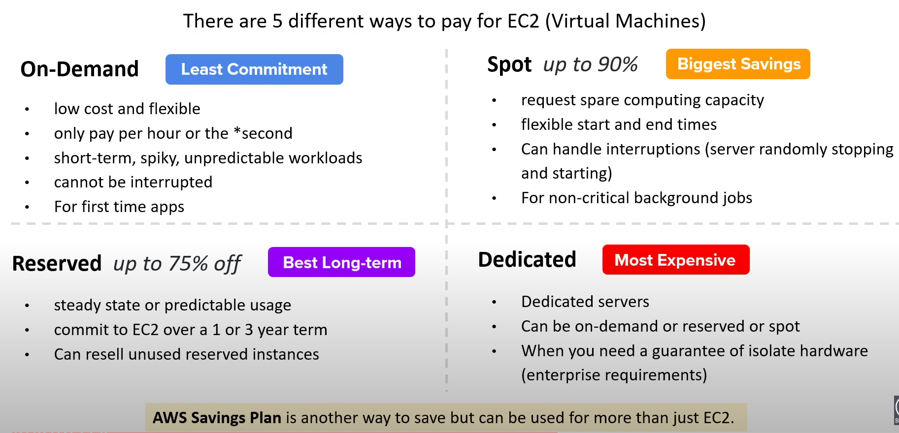

- [EC2 Pricing Models](#ec2-pricing-models)
    - [On demand](#on-demand)
    - [Reserved ](#reserved)
        - [Term](#term)
        - [Class](#class)
        - [Payment Options](#payment-options)
    - [Reserved Instance Attributes](#reserved-instance-attributes)
    - [Regional and Zonal RI](#regional-and-zonal-ri)
    - [RI Limits](#ri-limits)
    - [Capacity Reservations](#capacity-reservations)

---
## EC2 Pricing Models
---
 

- ### On Demand
    - <b> Pay-as-you-go (PAYG) model </b>
    - where you consume compute and then you pay
    - When you launch EC2 instance it is by default using on-demand pricing
    - On-demand has no up-front payment and no long-term commitment 
    - Charged by <b> second or the hour </b>
    - per second for :
        - Linux, Windows, Windows with SQL Enterprise, Windows with SQL standard and windows with SQL Web Instances that do not have a separate hourly charge
    - per-hour:
        - full hour for all other instance types
    - Use-cases:
        - applications is where workload is for <b> short-term, spikey or unpredictable or new app development or for experimenting </b>
- ### Reserved (RI)
    - Designed for applications that  have <b> Steady-state, predicatable usage or require reserved capacity </b>
    - Reduced pricing is based on <b> Term X Class Offering X RI Attributes X Payment Option </b>
    - ### Term
        - <i>{The longer the term the greater the savings}</i>
        - Commit to <u> 1 year  or 3 Year contract </u>
        - Reserved Instances do not renew automatically
        - When it is <u> expired it will use on-demand </u> with no interruption to service
    - ### Class 
        - <i> {The less flexible the greater savings} </i>
        - Standard 
            - Up to 75% reduced pricing compared to on-demand
            - Can modify RI attributes
        - Convertible 
            - Up to 54% reduced pricing compared to on-demand
            - can exchange RI based on RI attributes if greater or equal in value
    - ### Payment Options
        - <i> {The greater upfront the greater savings} </i>
        - <b> All upfront </b> : full payment at the start
        - <b> Partial Upfront </b> : A portion of the cost must be paid and remaining hours billed at a discounted hourly rate
        - <b> No Upfront </b> : billed at a discounted hourly rate for every hour within the term,regardless of whether the Reserved Instance is being used
    - <i><u> RIs can be shared between multiple accounts within AWS organisation </u> </i>
    - <b>Unused RIs </b> can be sold in the <u><i> Reserved Instance Marketplace</i></u>

---
## Reserved Instance (RI) Attributes 
--- 
- RI attributes
    - are limited based on class offering and can affect the final price of an RI instance
    - 4 RI attributes:
        - Instance Type:
            - eg. m4.Large. This is composed of the instance family (for example , m4) and the instance size (for example large)
        - Region:
            - The region in which the Reserved Instance is purchased
        - Tenancy:
            - Whether your instance runs on shared(default) or single-tenant (dedicated) hardware
        - Platform:
            - the operating system eg. Windows or Linux/Unix
---
## Regional and Zonal RI
---
| Regional RI : purchase for a region                         | Zonal RI : purchase for an Availability Zone                                       |
| ----------------------------------------------------------- | ---------------------------------------------------------------------------------- |
| does not reserve capacity | reserves capacity in the specified Availibility Zone |
| RI discount applies to instance usage in <u> any AZ</u> in the Region | RI discount applies to instance in the <u> selected AZ </u> (No AZ Flexibility) |
| Ri discount applied to instance usage within the instance family, regardless of size. Only supported n Amazon Linux, Unix Reserved Instances with default tenancy | No instance size flexibility    Ri discounts applies to instance usage for the specified instance type and size only    |
| You can queue purchases for regional RI  | You can't queue purchases for Zonal RI | 

---
## RI Limits 
---
- There is a limit to the number of Reserved Instances that you can purchase per month
    - Per month you can purchase
        - 20 Regional Reserved Instances per Region
        - 20 Zonal Reserved Instances per AZ

| Regional Limits | Zonal Limits | 
| --------------- | ------------ |
| You cannot exceed your running On-Demand Instance limit by purchasing regional Reserved Instances. The default On-Demand Instance limit is 20.  | You can exceed your running On-Demand Instance limit by purchasing zonal Reserved Instances| 
| Before purchasing RI ensure On-Demand limit is euqal to or greater than your RI you intend to purchase | If you already have 20 running On-Demand Instances, and you purchase 20 Zonal Reserved Instances, you can launch a further 20 On-Demand Instances that match the specifications of your zonal Reserved Instances |

---
## Capacity Reservations 
---
- EC2 instances are backed by different kind of hardware, and so there is a finite amount of servers available within an Availability Zone per instance type or family 
- You go to launch a specific type of EC2 instance but AWS has ran out of that server
- Capacity reservation is a service of EC2 that allows you to request a reserve of EC2 instance type for a specific Region and AZ