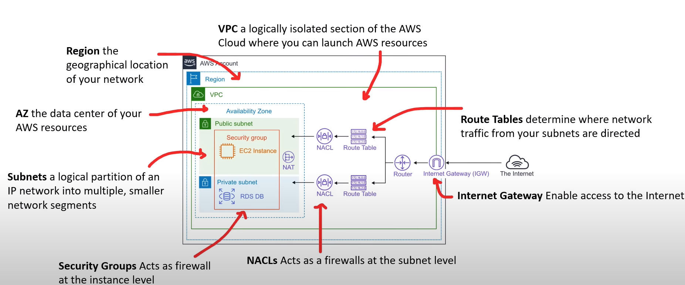
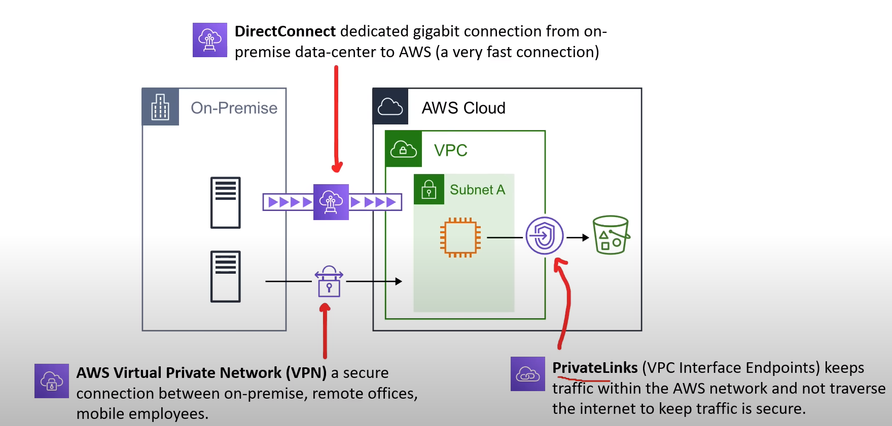
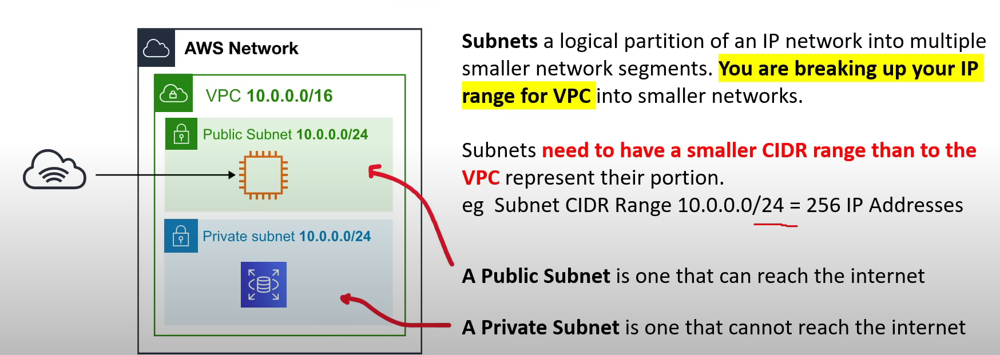
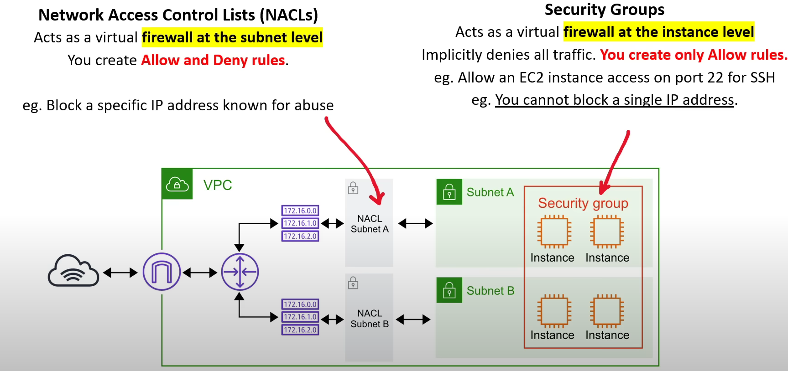

- [Cloud-Native Networking Services](#cloud-native-networking-services)
- [Enterprise/Hybrid Networking Services](#enterprise-hybrid-networking-services)
- [VPC and Sbnets](#vpc-subnets)
- [Security Groups vs NACLs](#security-groups-vs-nacls)
---
## Cloud-Native Networking Services
---

---
## Enterprise /Hybrid Networking Services
---

---
## VPC and Subnets 
---

- Virtual Private CLoud (VPC)
    - a logicaly isolated section of the AWS Network where you launch your AWS resources.
        - Choose a range of IPs using CIDR Range
        - CIDR range of 10.0.0.0/16 = 65,536 IP Addresses

--- 
## Security Group vs NACls
---
