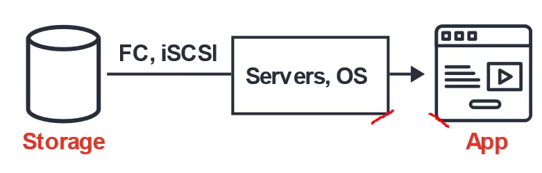
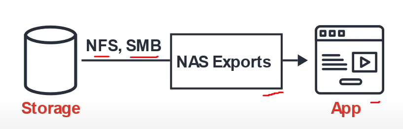
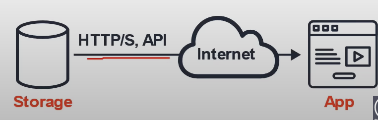
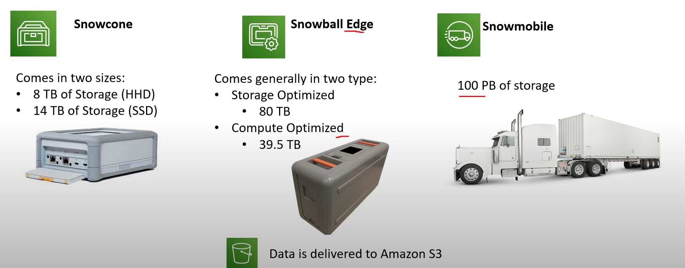

- [Types of Storage Services](#types-of-storage-services)
- [Introduction to S3](#introduction-to-s3)
- [S3 Storage Classes](#s3-storage-classes)
- [AWS Snow Family](#aws-snow-family)
- [Storage Services](#storage-services)

---
## Types of Storage Services
---
- <b> Elastic Block Store </b> (Block):
    - Data is split into evenly split blocks directly accessed by OS supports only a single write volume
    - Scenario: When you need a virtual hard drive attached to a VM
         
- <b>  AWS Elastic FIle Storage (EFS) </b> - (File)
    - File is stored with data and metadata 
    - Multiple connections via a network share 
    - Supports multiple reads, writing locks the file
    - Scenario: When you need a file-share where multiple users or VMs need to access the same drive 
    

- Amazon <b> Simple Storage Service (S3) </b> - (Object)
    - Object is stored with data, metadata and Unique ID
    - Scales with limited no file limit or storage limit
    - Supports multiple reads and writes (no locks)
    - Scenario: When you just want to upload files and not have to worry about underlying infrastructure. Not intended for high IOPs.

        

---
## Introduction to S3
---

- <b> What is Object Storage (Object-based storage)? </b>
- data storage architecture that manages data as objects, as opposed to other storage architectures:
    - file systems: which manages data as files and fire hierarchy
    - block storage- which manages data as blocks within sectors and tracks
        - S3 provides with <ins> Unlimited storage </ins>
        - Need not think about underlying infrastructure
        - S3 console provides an interface for you to upload and access your data 
        - Individual Object can be store form <ins> 0 Bytes to 5 Terabytes </ins> in size

| **S3 Object**                                                                   | **S3 Bucket**                                                           |
| ------------------------------------------------------------------------------- | ----------------------------------------------------------------------- |
| - Obejcts contain data(files)                                                   | - Buckets hold objects                                                  |
| - They are like files                                                           | - Buckets can have folders which can turn in hold objects               |
| Object may consists of:    - <b> Key </b> this is the name of the object   - <b> Value </b> data iteself is made up of sequence of bytes    - <b> Version Id </b> version of object (when versioning is enabled)   - <b> Metadata </b> additional information attached to the object                                               | - S3 is universal namespace so domain names must be <ins> Unique </ins>      | 

---
## S3 Storage Classes 
--- 

- AWS offers a range of S3 Storage classes that<ins> trade Retrieval, Time, Accessbility and Durability for Cheaper Storage </ins>

### (Descending from expensive to cheaper)

- <b> S3 Standard (default) </b>
    - Fast! 99.99 % Availability, 
    - 11 9's Durability. 
    - Replicated across at least three AZs

- <b> S3 Intelligent Tiering </b>
    - Uses ML to analyze object usage and determine the appropriate storage class
    - Data is moved to most cost-effective tier without any performance impact or added overhead

- <b> S3 Standard-IA (Infrequent Access) </b>
    - Still Fast! Cheaper if you access files less than once a month
    - <ins> Additional retrieval fee is applied</ins>. 50% less than standard (reduced availability)

- <b> S3 One-Zone-IA </b>
    - Still fast! Objects only exist in one AZ. 
    - Availability (is 99.5%). but cheaper than Standard IA by 20% less

- <b> S3 Glacier </b>
    - For long term cold storage
    - Retrieval of data can take minutes to hours but the off is very cheap storage

- <b> S3 Glacier Deep Archive </b>
    - The lowest cost storage class
    - Data retrieval time is 12 hours

---
## AWS Snow Family
---

- AWS Snow Family are <ins> Storage and compute devices used to physically move data in or out the cloud </ins> when moving data over the internet or private connection it to slow, difficult or costly

 

 ---
 ## Storage Services 
 ---

- <b> Simple Storage Service (S3)</b>
    - A <ins> serverless object storage service </ins> is created   
    - can upload very large files and unlimited amount of files 
    - you pay for what you store
    - Need not worry about the underlying file-system or upgrading the disk size

- <b> S3 Glacier </b>
    - Cold storage service
    - <ins> low cost storage solution </ins> for <i> archiving and long-term backup </i>
    - Uses previous generation HDD drives to get that low cost
    - highly secure and durable

- <b> Elastic Block Store (EBS) </b>
    - <ins> a persistent block storage service </ins>
    - virtual hard drive in the cloud to attach to EC2 instances 
    - can choose different kinds of storage: SSD, IOPS, SSD, Throughput HHD, Cold HHD

- <b> Elastic File Storage (EFS) </b>
    - <ins> a cloud-native NFS file system service </ins>
    - File storage you can mount to <ins> multiple Ec2 instances at the same time</ins>
    - When you need to share files between multiple EC2 instances

- <b> Storage Gateway </b>
    - <ins> a hybrid cloud storage </ins> service that extends your on-premise storage to cloud
        - <b> File Gateway </b> : extends your local storage to AWS S3
        - <b> Volume Gateway </b> : caches your local drives to S3 so you have continous backup of files on cloud
        - <b> Tape Gateway </b> : stores files on virtual tapes for very cost effective and long term storage
     
- <b> AWS Snow Family </b>
    - Storage devices used to physically migrate large amounts of data
    - <b> Snowball  and Snowball Edge </b> {Snowball does not exist anymore} briefcase size of data storage devices. 50-80 Terabytes
    - <b> Snowmobile </b> Cargo container filled with racks of storage and compute that is transported via semi-trailer tractor truck to transfer upto 100PB of data per trailer
    - <b> Snowcone </b> very small version of snowball that can transfer 8TB of data

- <b> AWS Backup </b>
    - a <ins> fully managed backup service </ins>
    - centralize and automate the backup of the backup data across multiple AWS services 
    - eg. EC2, EBS, RDS, DynamoDB, EFS, Storage Gateway
    - can create backup plans

- <b> Cloud Endure Disaster Recovery </b>
    - Continuously replicates your machines into low cost staging area in your target AWS account and preferred region enabling fast and reliable recovery if one of the data center fails

- <b> Amazon FSx </b>
    - <ins>a feature rich and highly-performant file system</ins>
    - Can be used for Windows (SMB) or Linux (Lustre)
        - <b> Amazon Fsx for Window File Server </b> uses the SMB protocol to and allows you to mount FSx to windows servers
        - <b> Amazon FSx for Lustre </b> uses Linux's Lustre file systems and allows you to mount FSx to Linux servers 

