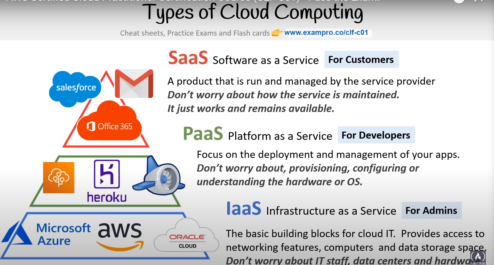
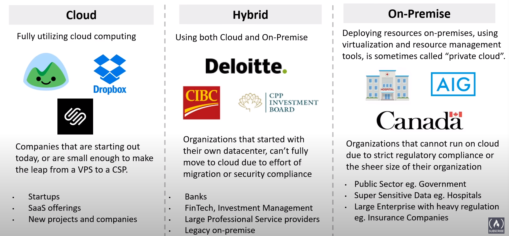

# Cloud Computing
- [What is cloud computing?](#what-is-cloud-computing)
- [Types of cloud computing](#types-of-cloud-computing)
- [Cloud computing deployment models](#cloud-computing-deployment-models)
    - [Public Cloud](#public-cloud)
    - [Private Cloud](#private-cloud)
    - [Hybrid](#hybrid)
    - [Cross Cloud](#cross-cloud)
- [Cloud Computing deployment models use cases](#cloud-computing-deployment-models-use-cases)

## Types of Cloud Computing 
--- 

---
## Cloud computing deployment models

---
## Cloud computing deployment models use cases

