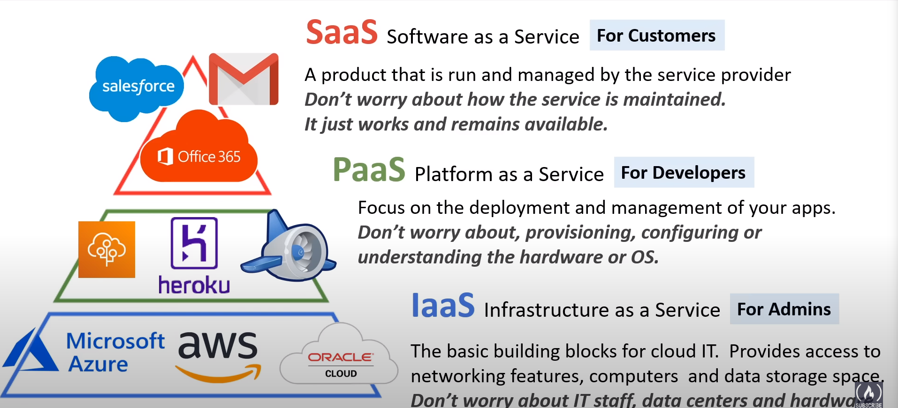
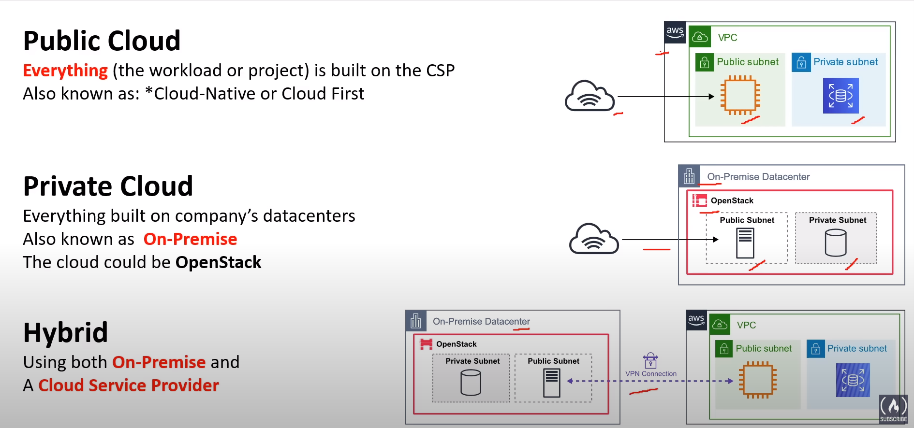

# Cloud Computing
- [What is cloud computing?](#what-is-cloud-computing)
- [Advantages of cloud computing](#advantages-of-cloud-computing)
- [Types of cloud computing](#types-of-cloud-computing)
- [Cloud computing deployment models](#cloud-computing-deployment-models)
    - [Public Cloud](#public-cloud)
    - [Private Cloud](#private-cloud)
    - [Hybrid](#hybrid)
    - [Cross Cloud](#cross-cloud)
- [Cloud Computing deployment models use cases](#cloud-computing-deployment-models-use-cases)
- [Benefits of cloud computing](#benefits-of-cloud-computing)
- [Global Infrastructure](#global-infrastructure)
- [Seven advantages to cloud](#seven-advantages-to-cloud)
- [Reference links](#reference-links)

## What is cloud computing?
--- 
- Cloud computing is <b><i> on-demand </i></b> delivery  of compute power, database, storage, applications and other IT resources thorugh a cloud services platform 
- <b> <i>pay-as-you-go pricing</i></b>
- provides <b><i> rapid-access and low-cost </i></b> IT resources 
- as many resources as you need and get instantly and only pay what you use

## Advantages of cloud computing
---

- <b> Pay as you go </b> 
    - pay only when you use computing devices and only for how much you use
- <b> Benefit mass economies from scale </b> 
    - usage of cloud services from hundreds of thousands of customers which leads to higher economy of scale (<i><ins>lower pay-as-you-go prices</ins></i>) 
- <b> Stop guessing capacity </b>
    - access as you want or little capacity as you need and scale up and down with only few minutes of notice
- <b> Increase speed and agility </b> 
    - IT resources are <i>one-click away</i> which increases agility for the organisation because the cost it takes to devlop and test is lower
- <b> Realize cost savings </b> 
    - companies can focus on business and customers instead of maintaining data centers 
    - be free of powering physical infrastructure (racking,stacking and heavylifting)
- <b> Go global in minutes </b> 
    - applications can be deployed in multiple regions around the world with just few clicks provides <i><ins> low latency and better experince at minimal cost</ins></i>

## Types of Cloud Computing 
--- 

- <b> SAAS </b>
    - offers services meant to be used by end users
    - example - Google's gmail service
    - AWS SAAS products
        - Simple Email service
        - Amazon workspaces 
- <b> PAAS </b>
    - hides the complexity of the infrastructure that runs it
    - often includes code that will run the application 
    - AWS PAAS products
        - Elastic Beanstalk
        - Elastic container service (ECS)
- <b> IAAS </b>
    - direct access to a provider's compute, storage and networking resources
    - AWS IAAS products 
        - Elastic cloud compute (EC2) for virtual machine instances
        - Elastic Block Store (EBS) for storage
        - Elastic load Balancing

## Cloud computing deployment models
---

## Cloud computing deployment models use cases
---

## Benefits of cloud computing
---
- Agility 
    - Increase speed and agility
- pay-as-you go pricing
    - Trade capital expense for variable expenses
- Economy of scale 
    - Benefit from massive economies of scale
- Global reach
    - Deploy globally in minutes
- Security
- Reliability
    - Stop spending money on running and maintaining data centers
- High availability    
- Scalability 
    - benefit from massive economies of scale
- Elasticity

## Global Infrastructure
--- 
- <b>What is AWS Global Infrastructure ? </b>
    - Globally distributed hardware and datacenters that are physically networked together to as one large resource for the end customer
- AWS infrastructure is built on AWS regions and availability zones
- Availability zones contains
    - discrete data centers
    - each with redundant power
    - networking connectivity in seperate zones
- AWS cloud operates in 
    - <i>99 availability zones 
    - 31 geographic regions
    - 108 Direct Connection locations 
    - 450+ Points of resource
    - 34 local zone
    - 29 wavelength Zones </i>
- Each Amazon region is isolated from the other Amazon region
    - pros:
        - greatest fault tolerance
        - stbility
        - availability zone in a region are connected through <i><ins> low latency links</ins></i>
- flexible to place instances and store data in multiple regions
 
- [For more information...](../global_infrastructure/global_infrastructure.md)

## Seven advantages to cloud
---

- <b>Cost-effective </b>
    - <i>pay for what you consume</i>
    - no up-front cost
    - on-demand pricing or Pay-as-you-go (PAYG) with thousands of customers sharing the cost of resources
- <b> Global </b>
    - Launch workloads <i> anywhere in the world</i>
- <b>Secure</b>
    - Cloud providers takes care of physical security
    - <i>cloud services can be secure by default</i>
    - have tha baility to configure access down to granular level
- <b> Reliable </b> 
    - data backup
    - disaster recovery
    - data reolication
    - fault tolerance
- <b>Scalable </b>
    - Increase or decrease resources and services based on demand
    - hels AWS with
        - Enormous numbers of server it operates
        - highly automated infrastructure administration systems
- <b>Elastic</b>
    - <i>Automate </i> scalling during spikes and drop in demand
- <b>Current </b>
    - Underlying hardware and managed software is patched, upgraded and replaced by the cloud provider without interruption to you

## Reference Links
---
- [AWS cloud practitioner essentials](https://explore.skillbuilder.aws/learn/course/134/play/62437/aws-cloud-practitioner-essentials)
- [AWS getting started](https://aws.amazon.com/getting-started/cloud-essentials/)
- [Watch AWS Certified Cloud Practitioner Certification Course](https://www.youtube.com/watch?v=SOTamWNgDKc&t=4805s)