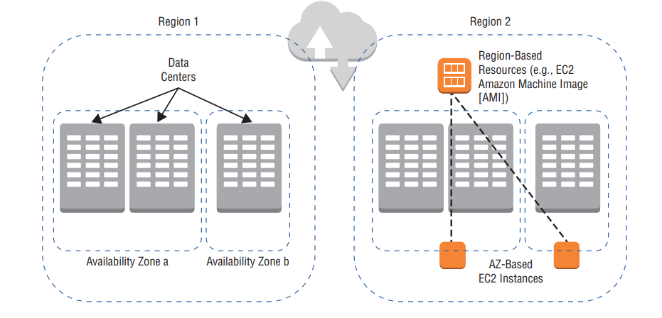
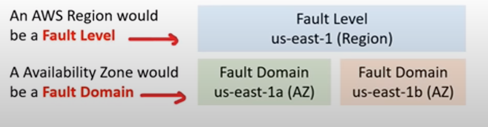

- [Global Infrastructure](#global-infrastructure)
    - [Global Infrastructure Regional vs Global](#global-infrastructure-regional-vs-global)
    - [Fault Tolerance](#fault-tolerance)
        - [What is fault domain ?](#what-is-fault-domain)
        - [Amazon regions and availibility zones](#Amazon-regions-and-availibility-zones)
    - [AWS Global Network](#aws-global-network)
    - [Points of Presence (PoP)](#points-of-presence)
        - [Tier 1](#tier-1)
        - [AWS Services use PoPs](#aws-services-use-pops)
    - [AWS Direct Connect](#aws-direct-connect)
    - [AWS Connect Locations](#aws-connect-locations)
    - [AWS Local Zones](#aws-local-zones)
    - [AWS wavelength zones](#aws-wavelength-zones)
    - [Data Residency](#data-residency)
    - [AWS for Government](#aws-for-government)
        - [GocCloud](#GovCloud)
    - [Sustainability](#sustainability)
    - [AWS Ground Station](#AWS-Ground-Station)
    - [AWS OutPosts](#Aws-outposts)

## Global Infrastructure
--- 
- <b>What is AWS Global Infrastructure ? </b>
    - Globally distributed hardware and datacenters that are physically networked together to as one large resource for the end customer

- AWS cloud operates in 
    - <i>99 availability zones 
    - 31 geographic regions
    - 108 Direct Connection locations 
    - 450+ Points of resource
    - 34 local zone
    - 29 wavelength Zones </i>

- <b>Availability Zone </b> is physical location made up of one or more datacenter.
    - AZs are represented by a region code, followed by a letter indetifier eg. us-east-1<u>a</u>
    - it is common to run workloads in at least 3 AZs in case any datacenter fails. <u> (High Availability)</u>
    - All AZs in a AWS Region are interconnected with 
        - high bandwidth
        - low-latency networking
        - over fully reduntant
        - dedicated mertro fiber providing high throughput
        - low - latency networking between them
- <b>Datacenter </b> is a secured building contains hundreds of thousands of computers
    - A region will generally contain <u> 3 Availability zones</u>
    
- Availability zones are redundantly connected to multiple tier 1 transit providers

## Global Infrastructure Regional vs Global
---

| **Regional Services**                                                             | **Global Services**                                                |
| --------------------------------------------------------------------------------- | ------------------------------------------------------------------ |
|  AWS ${\color{red}scopes}$ their AWS management console on selected region        | Some AWS services operate across multiple regions                  |
| determines where AWS service will be launched and what will be seen in the console | E.g. S3, CloudFront, Route53, IAM, AWS                             |

- Global services at the time of creation:
    - no concept of region eg. IAM user
    - single region explicitly chosen eg. S# Bucket
    - A group of regions are chosen eg. CloudFront Distribution

## Fault Tolerance
---

- ### What is fault domain ?
    - A section of a network that is <i>vulnerable to damage if a critical device or system fails </i>
    - Purpose: if failure occurs it will not cascade outside that domain, <u> <i> limiting the damage possible</i></u>
        
    - <b> What is fault level?</b>
        - a collection of fault domains
    - Scope of fault domain could be:
        - specific servers in a rack
        - an entire rack in a datacenter
        - an entire room in a datacenter
        - the entire datacenter building
    - (It is up to Cloud Service Providers (CSPs)  to define the boundaries of a domain)
    

- ### Amazon regions and availibility zones
    - Each Amazon region is completely <i>isolated</i> from the other Amazon regions
        - Achieves <b><i><u>greatest possible fault tolerance and stability</u></b></i>
    - Each availability zone is <i>isolated</i> but AZs are connected in a Region through <i>low-latency links</i>
        - Each availability zone is designed as <b><i><u>indenpendent failure zone</i></b></u> <i>{Failure zone is Fault Domain}</i>
        - <b> Failure Zone</b> 
            - Availibility zones are physically separated by metropolitan region and are located in low flood zones
            - Uninterruptible power supply (UPS) and onsite genration facilities
            - data centers located in different AZ are designed to be supplied by independent substations to reduce the risk of an event on the power grid impacting more than one availability zone
            - All AZs are redundantly connected to multiple tier-1 transit providers
        - <b> Multi-AZ for High Availability </b>
             - get high availability when
                - an application is partioned accross AZs, companies are better isolated and protected from natural issues {power outages, lighting strikes, tornadoes, earthquakes}

## AWS Global Network
---
- represents <b><i><u>interconnections between AWS Global Infrastructure</u></i></b>
- reffered as <i>"The backbone of AWS"</i>
- a private expressway - where things can move very fast between datacenters
    - <b>Edge locations: </b> 
        - to get data in and out of AWS very quickly
        - acts as <u><i>on and off ramps</i></u> to AWS Global Network
    - <b>AWS Global <u>Accelerator</u> and AWS S3 Transfer <u>Acceleration </u> </b>
        - Use <i>"Edge locations"</i> as <u>on-ramp</u> to <u>quickly</u> reach AWS resouces in other regions by traversing the fast AWS Global Network
    - <b> Amzon CloudFront (CDN)</b>
        - Use <i>"Edge locations"</i> as <u>off-ramp</u> to provide at the Edge storage and compute near the end user
- <b> VPC Endpoints </b>
    - <i>Ensures resources stay within the AWS Network</i> and do not traverse over Public Network
          
## Points of Presence (PoP)
---
- intermediate location between AWS region and end user 
- this could be datcenter or collection of hardware
    - For AWS a PoP is
        - a data center owned by <i> <u>AWS or a tursted partner</u></i> that is utilised by AWS services related for <i> content delivery or expedited upload</i>
- Pop Resources:
    - Edge locations 
        - are datacenters that hold  cached (copy) on the <u><i>most popular files</i></u> 
        - eg. web pages, images and videos
        - so that delivery distance to end users is less
    - Regional Edge Caches
        - are datacenters that hold larger cache on <u><i> less-popular files</i></u>
        - to reduce the full round trip and cost of transfer fees

    
- ### Tier 1
    - PoPs live at the edge/intersection of two netwroks 
    - Tier 1 network can reach every other network on the internet <i><u> without purchasing IP transit or paying for peering </u></i>
    - AWS AZs are redundantly connected to multiple <i>tier-1 transit providers</i>

    

- ### AWS Services uses PoPs
    - for <u><i>content delivery or expedited upload</i></u>
    - <b> Amazon CloudFront </b>
        - point the website to CloudFront so that it will route requests to nearest <i>"Edge Location cache"</i>
        - allows to choose an <u>origin</u> (such as web server or storage ) that will be source of cached
        - caches the contents returned by origin to various Edge Locations in the world
    - <b> Amazon S3 Transfer Acceleration </b>
        - allows to generate <i>specific URL</i> that can be used by end users to <u><i>upload files to nearby "Edge Location" </i></u>
        - Once the file is uploaded to Edge Location it <u><i>moves much faster</i></u> within AWS Network to reach S3
    - <b> Amazon Global Accelerator </b>
        - global accelerator deploys within Edge Location such that <i><u>user traffic is sent to "Edge Location" instead of web application</i></u>
        - finds the optimal path from the end user to web-servers

## AWS Direct Connect
---
-<i> A private/dedicated connection between data center,office, co-location and AWS </i>

- Two very fast network connection options:
    1. Lower Bandwidth <b> 50MBps - 500MBps</b>
    2. Higher Bandwidth <b> 1Gbps or 10Gbps</b>
- <b>Pros:</b>
    - reduce network costs and increase bandwidth thorughput (great for high traffic)
    - provide more consistent network (reliable and secure)

    
- <b>Co-location </b> is a data center where equipment, space and bandwidth are available for rental to retails customers.

## AWS Connect Locations
--- 

- <i> Trusted partnered data centers that you can establish a dedicated/private high speed, low-latency from your on-premise to AWS</i>

## AWS Local Zones
---
- <i><b>Local Zones</b> are located very close to highly populated area to provide <u>very low-latency performance (single digit eg. 7ms)</u> for that area.</i>
- LA, California was the first Local Zone to be deployed
    - It is a logical extension of the US-West Region
    - Identifier looks like: <b> us-west-2-lax-1a</b>
- Only specific AWS Services have been made available
    - EC2 instance types (T3,C5,R5,R5d,I3en,G4)
    - EBS
    - Amazon Fsx
    - Application Load Balancer
    - Amazon VPC
-<i> Purpose:</i>
    - support highly-demanding applications sensitive to latencies
        - Media & Entertainment
        - Electronic Deisgn AUtomation
        - Ad-Tech
        - Machine Learning

## AWS Wavelength Zones
--- 
- <b>AWS Wavelength Zones</b> allows for <i><u>edge-computing on 5G Networks</u></i>
- Applications have <i><u> ultra-low latency </u></i> being close to users
- AWS partnered with Telecom companies to utilize 5G networks. (e.g. Verizon, Vodafone, SK telecom)
- create a Subnet tied to a wavelength zone and then you can launch virtual machines (VMs) to the edge of the targeted 5G Networks
 
## Data Residency
---

- <b> What is Data Residency?</b>
    - <i> The physical or geographical location of where an organisation or cloud resources reside</i>
- <b> What is compliance Boundaries?</b>
    - <i> A regulatory compliance (legal requirement) by a government or organisation where data and cloud resources are allowed to reside </i>
- <b> What is Data Sovereignty?</b>
    - <i>It is jurisdictional control or legal authority that can be used over data because it's physical location is within jurisdictional boundaries.</i>
- For workloads that need to meet compliance boundaries:
    - <b>AWS outposts</b> is physical rack of servers that you can put in your data center. Your data will reside wherever outpost physically resides
    - <b>AWS config</b> is a Policy code service
        - You can create rules to conitnous check AWS resources configuration
        - If they deviate you can add check to be alerted or to auto remediate
    - <b>IAM Policies</b> can be written explicitly deny access to apecific AWS Regions
        - A <b> Service Control Policy</b> are permissions applied organisation wide

## AWS for Government
---

- <b>What is Public sector?</b>
    - Public sector includes public goods and governmental services such as:
        - military
        - law enforcements
        - infrastructure
        - public transit
        - public education
        - health care
        - the government itself
- AWS can be utilised by public sector or organisations developing cloud workloads for the public sector
    - achieves by <i><u> regulatroy compliance programs</u></i> along with specific government and security controls

- ### GovCloud
    - <b>Federal Risk and Authorisation Management Program (FedRAMP) </b>
        - A US-government program provides standard approrahc to security assessment, authorization and continous monitoring for cloud products and services.
    - <b> What is GovCloud?</b>
        - A Cloud service provider (CSP) offers an isolated region to rub FedRAMP workloads
    - AWS GovCloud Regions - allows customers to host sensitive  <b>Controlled Unclassified Information</b> and other workloads
    - Only operated and accessed by U.S citizens on U.S. soil or who pass a screening test (root account holders)

## Sustainability
---

- Goals:
    1. Renewable ENergy : 
        - planning to be 100% renewable energy by 2025
        - purchases and retires environamental attributes to cover non-renewable energy 
            - Renewable Energy Credits (RECs)
            - Guarantess of Origin (Gos)
    2. Cloud Efficiency:
        - 3.6 times more energy efficient that median of US enterprise data centers surveyed
    3. Water Stewardship:
        - Direct evaporative technology to cool our data centers
        - use of recycled water for cooling
        - On-site water treatment - allows reuse of water for more cycles 
        - Monitor water efficiency metrics

## AWS Ground Station
---

- lets to <b>control satelite communications</b> , process data and scale operations without building or managing ground station infrastructure
- Use cases:
    - weather forecasting 
    - surface imaging 
    - communications
    - video boradcasts
- To use the ground station:
    - schedule a contract (select satelite, start and end time and the gorund location )
    - Use the AWS ground station EC2 AMI to launch EC2 instances that will uplink and downlink data during the contact or recieve downlinked data in Amazon S3 bucket

## AWS Outposts
---

             

