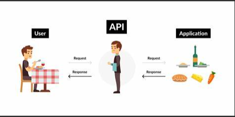

- [Application Programming Interface](#application-programming-interface)

## Application Programming Interface
---
- <b> What is API? </b>
    - Two applications/services talk to each other mostly by HTTP/s requests.
    
    