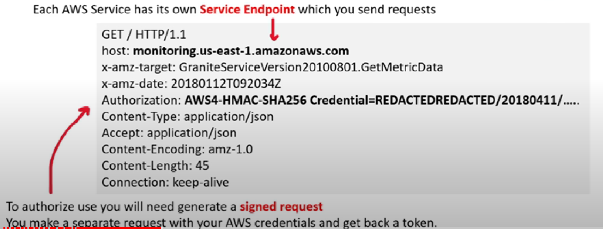
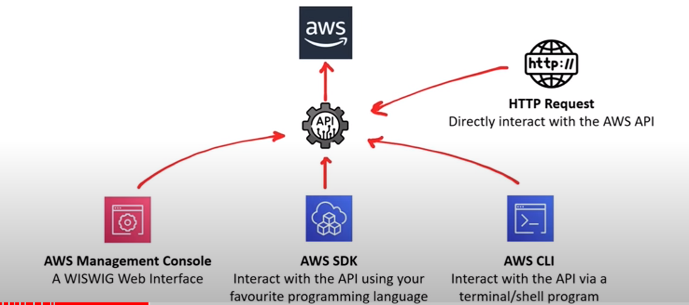
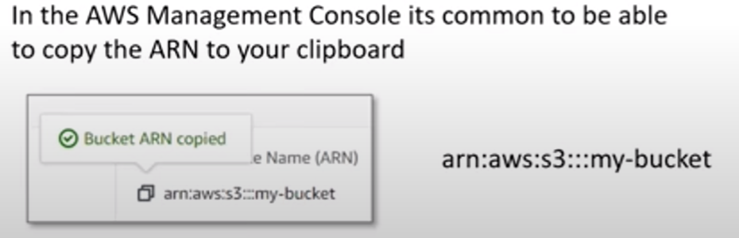
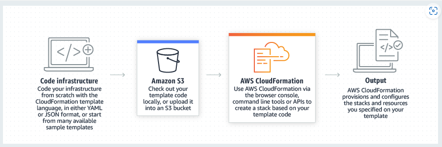
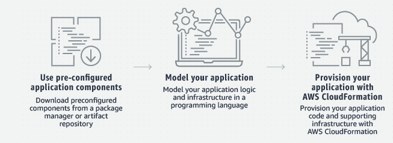

- [Application Programming Interface](#application-programming-interface)
- [AWS Management Console](#aws-management-console)
- [Amazon Resource Name ](#amazon-resource-name)
- [Infrastructure as code](#infrastructure-as-code)
    - [Cloud Formation](#cloud-formation)
    - [Cloud Development Kit](#cloud-development-kit)

## Application Programming Interface
---
- <b> What is API? </b>
    - Two applications/services talk to each other mostly by HTTP/s requests.
    
    

    - AWS API is HTTP API and can interact by sending HTTP requests, using Postman (application for interacting with APIs)

    

    - Rarely users directly send HTTP requests directly to AWS API
    - It is much easier to interact with API via developer tools

    

## AWS Management Console
---
- web based unified console for Build, manage and monitor everything from simple web apps to complex cloud deployments

## Amazon Resource Name (ARNs)
---
- <i> Uniquely identify AWS resources</i>
- Required to specify a resource unambigously across all AWS
- AWS has following format variations
    - arn:partion:service:region:account-id:resource-id 
    - arn:partition:service:region:account-id:resource-type/resource-id 
    - arn:partition:service:region:account-id:resource-type: resource-id 
- Partition:
    - aws-AWS Regions
    - aws-cn - China Regions
    - aws-us-gov - ChinaAWS GovCloud (US) regions

- Service - Identifies the service
    - ec2
    - s3 
    - iam

- Region - which aws resource
    - us-east-1
    - ca-central-1

- Account ID
    - 121212121212
    - 123456789012

- Resource ID
    Could be a number name or path:
        - user/Bob
        - instance/i-12345670abcdef0

- ARNs can include a path - add (*)
    - IAM Policy ARN Path
        - arn:aws:iam::123456789012:user/Development/product_1234/*
    - S3 ARN Path
        - arn:aws:s3:::my_corporate_bucket/Development/*

## Infrastructure as Code
---

- You write a configuration to <i>automate, create , updating or destroying</i> the cloud infrastructure
-  blueprint of your infrastructure
- Easily allows to share, version or inventory your cloud infrastructure
- Two offering to write Infrastructure as Code:
    - AWS CloudFormation (CFN):
        - Declarative Iac Tool
        - What you see is What you get <b>Explicit </b>
        - More Verbose, <b>ZERO</b> chance of misconfiguration
        - Uses scripting languages - JSON, XML,YAML
    - AWS Cloud Development Kit (CDK)
        - Imperative IaC tool
        - You say what you want and rest is filled in. <i><b>Implicit</i></b>
        - Less verbose, more chance of misconfiguration 
        - Does more than declarative 
        - Uses programming languages Python, Ruby, Javascript

    ## Cloud Formation 
    --- 

    - Allows to write IaC as JSON or YAML file
    - Easier for DevOps ENgineers who do not have a background in web programming languages
    - simple but lead to large files or limited to creating dynamic or repeatable infrastructure compared to CDK
    - helps to model and steup AWS resources so that we can focus more on application and less time managing the resources 
    - Using Cloud Formation create a template what resources are needed (like Amazon Ec2 or Amazon RDS DB instances)

    

    - Once the template is created CloudFormation takes care of cofiguring and provisioning  
    - It simplifies Infrastructure management, quickly replicate your infrastructure and easily control and track changes of infrastructure

    ## Cloud Development Kit
    ---

    - CDK piplines to quickly setup CI/CD pipelines fro CDK projects 
    - Has testing framework for Unit and Integration Testing
    - helps to expedite new projects
    - CDK is powered by CoudFormation
    - Has large library of resuable cloud components called CDK Construct <l> https://constructs.dev </l>

    
    
    - {Note:  AWS SDK and CDK looks similar but CDK ensures Idempotent of Infrastructure}
