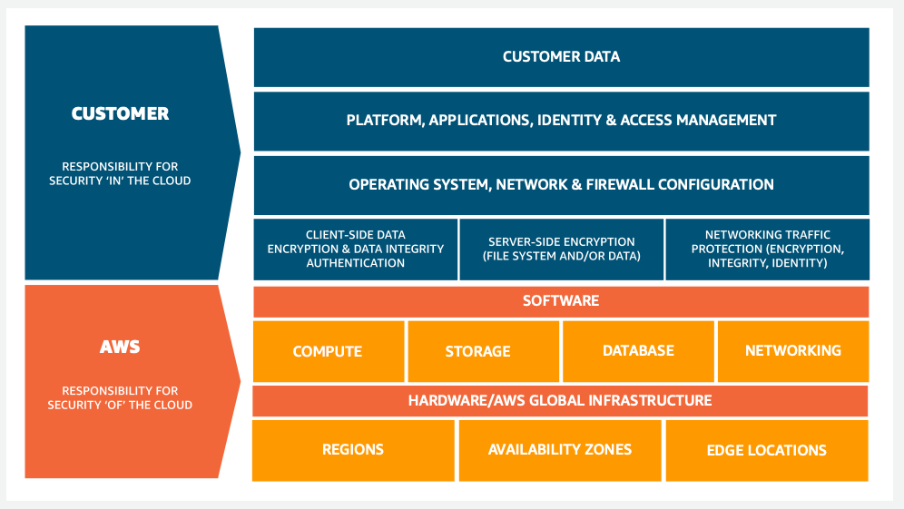
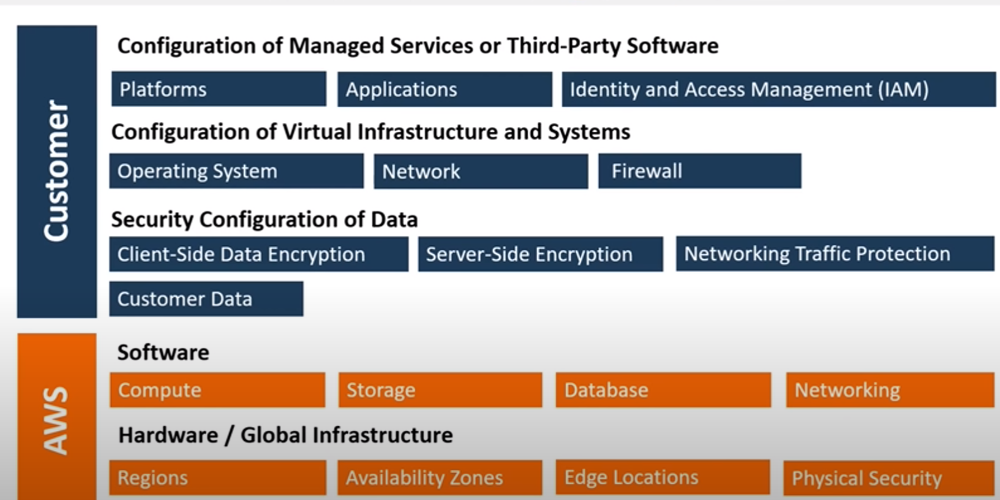
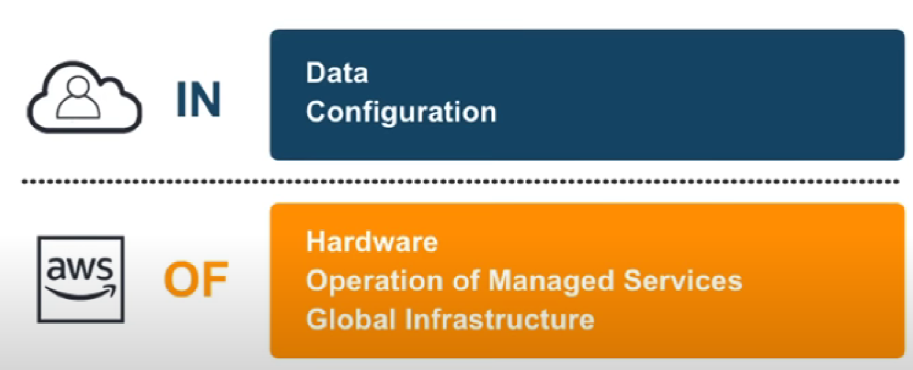
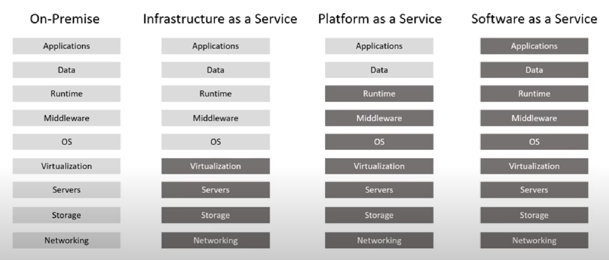
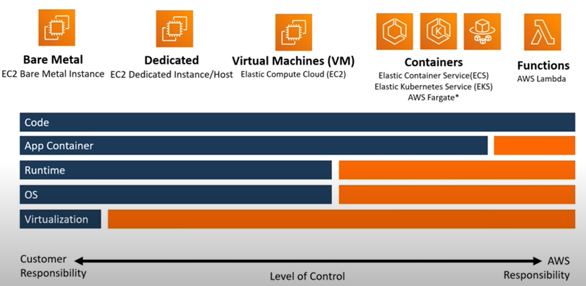

- [Shared Responsibility Model](#shared-responsibility-model)
- [Types of Cloud Computing Responsibility](#types-of-cloud-computing-responsibility)
- [Shared Responsibility for Compute](#shared-responsibility-for-compute)

## Shared Responsibility Model
--- 

- <b>  A cloud security framework </b>
- Distiniction of responsibility is commonly referred to as security "of" the cloud verse security "in" the cloud

- detailed version 
    - 
- short version of the shared responsibility model
    - customers are responsible for Security <i>"in"</i> the cloud

    

    - AWS is responsible for Security <i>"of"</i> the cloud

## Types of Cloud Computing Responsibility
---

## Shared Responsibility for Compute
---

- <b> Infrastructure as a Service (IaaS) </b>
    - Bare Metal { EC2 Bare metal instance}
        - Customer:
            - The Host OS configuration
            - Hypervisor
        - AWS:
            Physical Machine
    - Virtual Machine {Elastic Cloud Compute, EC2}
        - Customer:
            - The Guest OS configuration
            - Container Runtime
        - AWS:
            - Hypervisor, Physical Machine
    - Containers {AWS Elastic Container Service, ECS}
        - Customer:
            - Configuration of containers
            - Deployment of containers
            - Storage of containers
        - AWS:
            - The OS, The Hypervisor, Container Runtime

- <b> Platform as a Service (PaaS) </b>
    - Manged Platform {AWS Elastic Beanstalk}
        - Customer:
            - Uploading your code 
            - Some configuration of environment
            - Deployment Strategies
            - Configuration of associated services
        - AWS:
            - Netwroking, Storage, Servers, OS, Security

- <b> Software as a Service (SaaS) </b>
    - Content Collaboration {Amazon WorkDocs}
        - Customer:
            - Contents of documents
            - Management of files
            - Configuration of sharing access controls {eg: like word docs, excel sheets}
        - AWS: 
            - Networking, Storage, Servers, OS, Security

- <b> Function as a Service (FaaS) </b>
    - Functions {AWS Lambda}
        - Customer:
            - Upload your code 
        - AWS:
            - Deployment, Container Runtime, Networking, Storage, Security, Physical Machine, (basically evrything)

    
