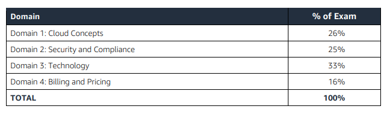

## Content Outline:
- [Target candidate description](#target-candidate-description)
- [Test Domain](#test-domain)
- [Domain 1: Cloud Concepts – 26%](#domain-1-cloud-concepts–26%)
- [Domain 2: Security – 25%](#domain-2-security–25%)
- [Domain 3: Technology – 33%](#domain-3-technology–33%)
- [Domain 4: Billing and Pricing – 16%](#domain-4-billing-and-Pricing–16%)

## Target candidate description
The target candidate should have 6 months, or the equivalent, of active engagement with the AWS Cloud, 
with exposure to AWS Cloud design, implementation, and/or operations. Candidates will demonstrate an 
understanding of well-designed AWS Cloud solutions. 

Recommended AWS knowledge
- The target candidate should have the following knowledge:
- AWS Cloud concepts
- Security and compliance within the AWS Cloud
- Understanding of the core AWS services
- Understanding of the economics of the AWS Cloud

## Test Domain

## Domain 1: Cloud Concepts – 26%
- 1.1 - Define the AWS Cloud and its value proposition
- 1.2 - Identify aspects of AWS Cloud economics
- 1.3 - List the different cloud architecture design principles

The first domain requires you to understand what the cloud is, what technologies it’s built on, what kinds of cost savings and operational advantages it can bring you, and how cloud-based applications work differently than traditional hosted ones.

## Domain 2: Security – 25%
- 2.1 - Define the AWS shared responsibility model
- 2.2 - Define AWS Cloud security and compliance concepts
- 2.3 - Identify AWS access management capabilities
- 2.4 - Identify resources for security support

The second domain requires you to understand how AWS itself organizes its hardware, networking, and security infrastructure. The important thing to know is how the responsibility is divided between the customer and AWS when using AWS services. And with that responsibility, you need to ensure proper security and compliance.

## Domain 3: Technology – 33%
- 3.1 - Define methods of deploying and operating in the AWS Cloud
- 3.2 - Define the AWS global infrastructure
- 3.3 - Identify the core AWS services
- 3.4 - Identify resources for technology support

In the third domain, you need to understand the key tools that enable you to configure and monitor your AWS resources.

Although each AWS service has its own unique aspects when it comes to configuration, AWS offers two common tools (AWS Management Console & AWS Command Line Interface (CLI)) to interact with all of them.

Important to know how AWS provides layers of support to help customers on the platform and what kinds of AWS support are available and how to find them.

## Domain 4: Billing and Pricing – 16%
- 4.1 - Compare and contrast the various pricing models for AWS
- 4.2 - Recognize the various account structures in relation to AWS billing and pricing
- 4.3 - Identify resources available for billing support

In the last domain, you need to know what the Cloud is going to cost you. Because cloud services are scalable, there’s virtually no limit to how much you can purchase, or how much it can cost you. If something isn’t going according to plan, you’ll want to know what it is and how to pull its plug as soon as possible.

## What is considered out of scope for the target candidate?
The following is a non-exhaustive list of related job tasks that the target candidate is not expected to be 
able to perform. These items are considered out of scope for the exam:
- Coding
- Designing cloud architecture 
- Troubleshooting 
- Implementation 
- Migration 
- Load and performance testing
- Business applications (for example, Amazon Alexa, Amazon Chime, Amazon WorkMail)

To view a detailed list of specific tools and technologies that might be covered on the exam, as well as lists 
of in-scope AWS services, refer to the Appendix

